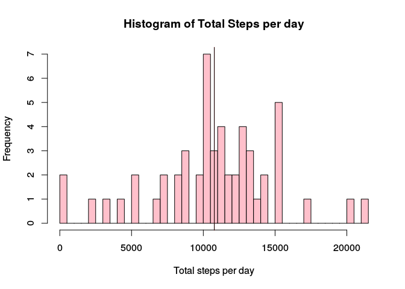
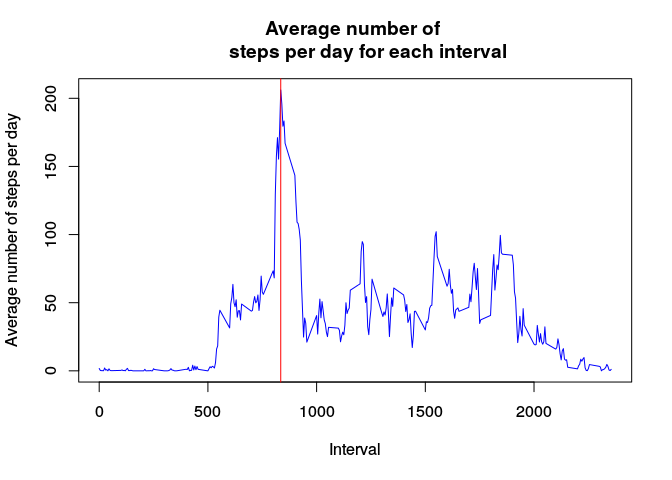
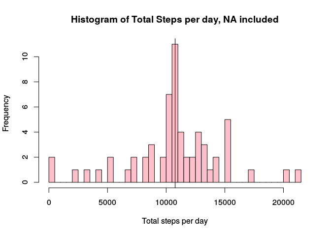
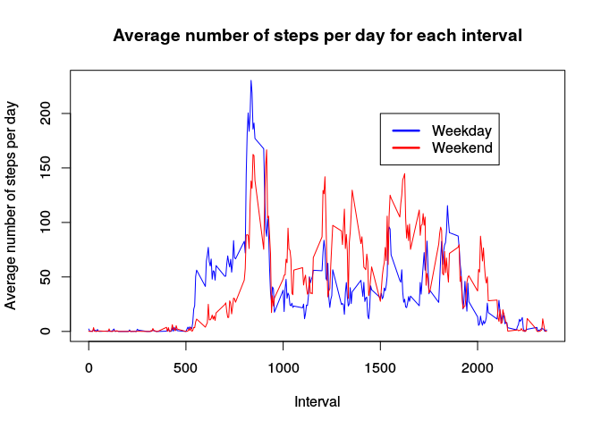

# Week2_Assignment


```r
library(dplyr)
```

```
## 
## Attaching package: 'dplyr'
```

```
## The following objects are masked from 'package:stats':
## 
##     filter, lag
```

```
## The following objects are masked from 'package:base':
## 
##     intersect, setdiff, setequal, union
```

```r
activity<-read.csv('~/Documents/coursera/reproduce/activity.csv')
activity<-na.omit(activity)
g<-group_by(activity, date)
a<-summarise(g, total = sum(steps))
a$date<-as.Date(a$date, "%Y-%m-%d")

hist(a$total, freq=TRUE, breaks = length(a$total), col = "pink", xlab = 
       "Total steps per day", main = "Histogram of Total Steps per day")
abline(v=mean(a$total), col = "red")
abline(v=median(a$total), col = "black")
```

<!-- -->

```r
#The mean is:
a1_mean<-mean(a$total)
a1_mean
```

```
## [1] 10766.19
```

```r
#The median is:
a1_median<-median(a$total)
a1_median
```

```
## [1] 10765
```


```r
library(dplyr)

activity<-read.csv('~/Documents/coursera/reproduce/activity.csv')
activity<-na.omit(activity)
g<-group_by(activity, interval)
a<-summarise(g, average = mean(steps))

plot(a$interval, a$average, type="l", col = "blue", xlab = "Interval", 
     ylab = "Average number of steps per day", main = "Average number of 
     steps per day for each interval")

abline( v= a$interval[a$average==max(a$average)], col = "red")
```

<!-- -->

```r
#The most active interval is:
a$interval[a$average==max(a$average)]
```

```
## [1] 835
```


```r
library(dplyr)
activity<-read.csv('~/Documents/coursera/reproduce/activity.csv')
cractivity<-na.omit(activity)
g<-group_by(cractivity, interval)
a<-summarise(g, average = mean(steps))


#The number of NA rows is:
sum(is.na(activity))
```

```
## [1] 2304
```

```r
#Fill in NAs with average for that interval
repeated<-rep(a$average, length(activity$steps)/length(a$interval))
activity$repeated<-repeated
activity$steps[is.na(activity$steps)]<-activity$repeated[is.na(activity$steps)]

g<-group_by(activity, date)
a<-summarise(g, total = sum(steps))
a$date<-as.Date(a$date, "%Y-%m-%d")

hist(a$total, freq=TRUE, breaks = length(a$total), col = "pink", xlab = 
       "Total steps per day", main = "Histogram of Total Steps per day, NA included")
abline(v=mean(a$total), col = "red")
abline(v=median(a$total), col = "black")
```

<!-- -->

```r
#The mean is:
a2_mean<-mean(a$total)
a2_mean
```

```
## [1] 10766.19
```

```r
#The median is:
a2_median<-median(a$total)
a2_median
```

```
## [1] 10766.19
```

```r
#The difference of mean before is:
a2_mean-a1_mean
```

```
## [1] 0
```

```r
#The difference of median before is:
a2_median-a1_median
```

```
## [1] 1.188679
```


```r
library(dplyr)
activity<-read.csv('~/Documents/coursera/reproduce/activity.csv')
cractivity<-na.omit(activity)
g<-group_by(cractivity, interval)
a<-summarise(g, average = mean(steps))


#The number of NA rows is:
sum(is.na(activity))
```

```
## [1] 2304
```

```r
repeated<-rep(a$average, length(activity$steps)/length(a$interval))
activity$repeated<-repeated
activity$steps[is.na(activity$steps)]<-activity$repeated[is.na(activity$steps)]
activity$date<-as.Date(activity$date, "%Y-%m-%d")
activity$date<-weekdays(activity$date)
activity$weekday<-ifelse(activity$date=="Saturday" | activity$date=="Sunday", 0, 1)


activity_weekday<-filter(activity, weekday==1)
activity_weekend<-filter(activity, weekday==0)
g_weekday<-group_by(activity_weekday, interval)
a_weekday<-summarise(g_weekday, average = mean(steps))
g_weekend<-group_by(activity_weekend, interval)
a_weekend<-summarise(g_weekend, average = mean(steps))

plot(a_weekday$interval, a_weekday$average, 
     type="l", 
     col = "blue", 
     xlab = "Interval", 
     ylab = "Average number of steps per day", 
     main = "Average number of steps per day for each interval")

lines(a_weekend$interval, a_weekend$average, type="l", col = "red")
legend(1500,200,  c("Weekday","Weekend"), 
       lty=c(1,1), 
       lwd=c(2.5,2.5),col=c("blue","red"))
```

<!-- -->
